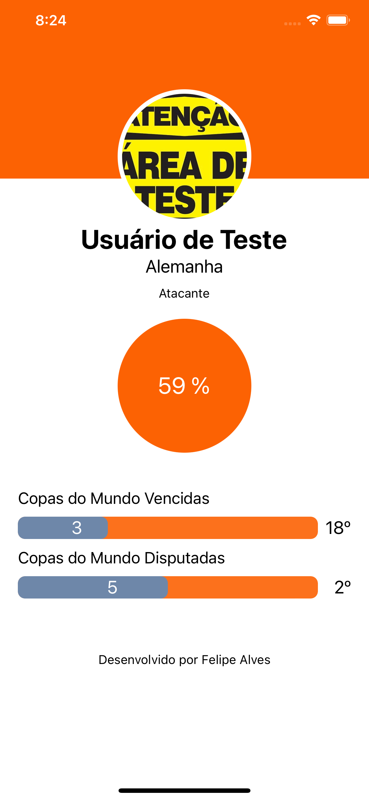

<p align="center">

  <h2 align="center">SportMatch</h2>

  <p align="center">
    <br />
    <small>Simple App for list details abouit teams</small>
    <br />

  </p>
</p>

## Contents

- [Contents](#contents)
- [About The Project](#about-the-project)
  - [Built With](#built-with)
- [Getting Started](#getting-started)
  - [Installation](#installation)
- [Contributing](#contributing)
- [Screenshots](#screenshots)
- [Contact](#contact)

## About The Project

<p align="center">
  
</p>

<br />

### Built With

-   [Expo - v.44.0.2"](https://expo.io/)
-   [ReactNative - v.0.65.1](https://reactnative.dev/)

## Getting Started

To get a local copy up and running follow these simple steps.

### Installation

1. Clone the repo

```sh
git clone https://github.com/felipealvescosta/sportmacth
```

2. Install packages

```sh
yarn install
```

3. Run Project

```sh
expo start
```


4. Run Project

```sh
press letter 'i' for open ios emulator or 'a'  for open android emulator
```


## Contributing

Contributions are what make the open source community such an amazing place to be learn, inspire, and create. Any contributions you make are **greatly appreciated**.

1. Fork the Project
2. Create your Feature Branch (`git checkout -b feature/YourFeature`)
3. Commit your Changes (`git commit -m 'Add some YourFeature'`)
4. Push to the Branch (`git push origin feature/YourFeature`)
5. Open a Pull Request

## Screenshots

<p align="center">
  
</p>

## Contact

[Felipe Alves](https://felipealvescosta.com) - [LinkedIn](https://www.linkedin.com/in/felipealvesdacosta/) - [GitHub](https://github.com/felipealvescosta)
